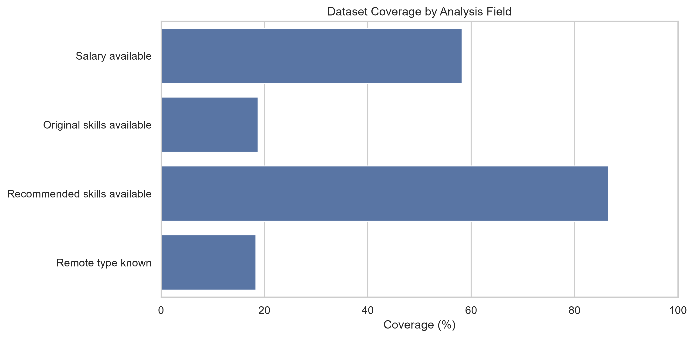
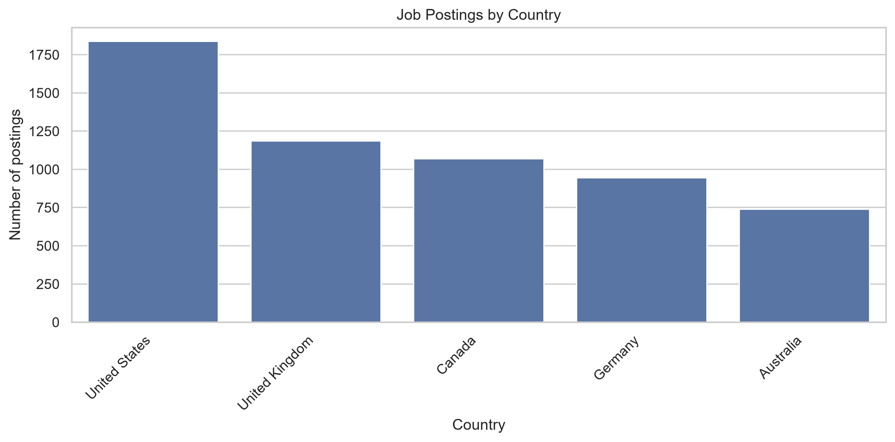
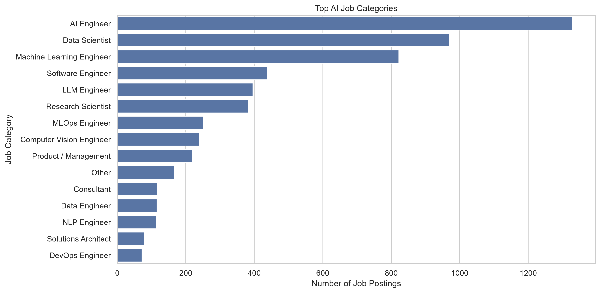
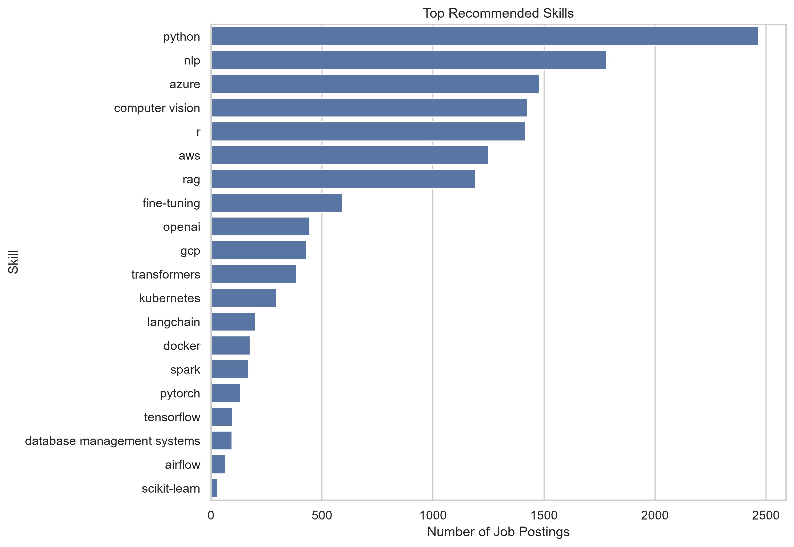
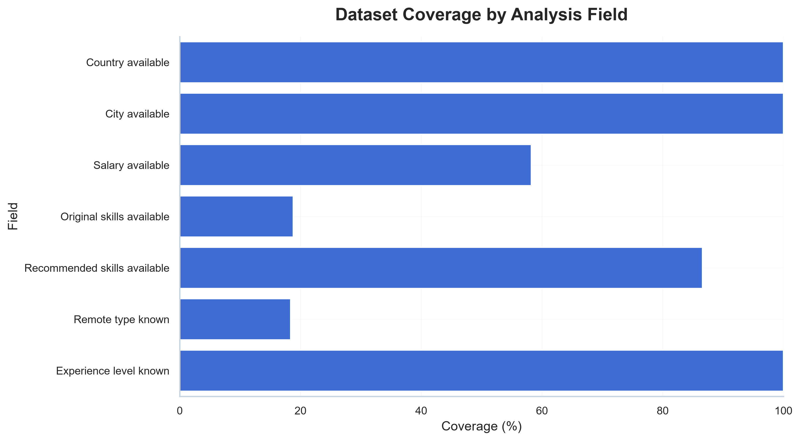

# 2026 AI Job Market Analysis

## Overview

This project is an end-to-end data science and machine learning analysis of the 2026 AI job market.

The goal is to transform a noisy job posting dataset into a structured market intelligence dataset that can be used to analyze:

- AI and Data job categories
- Required technical skills
- Salary trends
- Country-level hiring patterns
- Remote and hybrid work distribution
- Skill gaps and market signals
- Machine learning patterns in job descriptions

The project combines data cleaning, feature engineering, job title normalization, ESCO occupation mapping, skill enrichment, local LLM validation, exploratory data analysis, and machine learning.

This is not only a visualization project. It is a complete applied AI/data pipeline designed to convert messy job postings into structured insights.

## Why This Project Matters

AI job postings are often difficult to analyze because they contain noisy job titles, incomplete skill fields, inconsistent descriptions, missing salary information, and overlapping role definitions.

For example, the same type of position can appear under many different titles:

- AI Engineer
- Generative AI Engineer
- LLM Engineer
- Machine Learning Engineer
- Applied Scientist
- AI Software Engineer
- MLOps Engineer

At the same time, many postings do not explicitly list required skills, even when the job description strongly implies them.

This project addresses these problems by building a structured analysis pipeline that:

- Cleans and standardizes raw job market data
- Normalizes job titles into a custom AI job taxonomy
- Maps job categories to ESCO occupation labels when possible
- Enriches missing skills using similar job postings
- Validates inferred skills with a local LLM through Ollama
- Preserves traceability between original, inferred, validated, and final recommended skills
- Produces analysis-ready datasets for market insights and machine learning

## Technical Highlights

This project demonstrates practical experience with:

- Data cleaning and preprocessing
- Exploratory data analysis
- Feature engineering
- Job title normalization
- Custom taxonomy design
- ESCO occupation mapping
- Skill extraction and enrichment
- KNN-based similarity search
- Local LLM validation with Ollama
- Rule-based post-processing
- Data quality analysis
- Salary analysis
- Multi-label skill modeling
- Text classification
- Clustering and market segmentation
- Machine learning model evaluation
- Portfolio-ready data visualization

## Dataset Summary

The final dataset contains:

- 5,773 AI-related job postings
- 5 countries
- 16 normalized job categories
- Salary information when available
- Job titles and descriptions
- Company, country, city, experience level, and remote status
- Original required skills when provided
- Enriched recommended skills generated by the skill completion pipeline

The original dataset had limited skill coverage. Only a small portion of postings contained explicit required skills.

To make skill demand analysis more useful, the project creates a final recommended skill signal by combining original skills, similarity-based inference, local LLM validation, and rule-based rescue logic.

## Dataset Coverage

The project starts with an important data quality question: which fields are reliable enough to analyze?

The dataset has strong coverage for basic job information, but weaker coverage for salary and original skill fields.

This is why the project includes a dedicated skill enrichment pipeline instead of relying only on the original `required_skills` column.

## Project Notebooks

| Notebook | Purpose |
|---|---|
| `01_build_skill_dataset.ipynb` | Builds the final analysis dataset. This notebook cleans the raw job posting data, normalizes job titles, creates a custom AI role taxonomy, maps roles to ESCO occupations, enriches missing skills using KNN similarity, validates inferred skills with a local Ollama LLM, applies rescue rules for obvious removed skills, and exports the final dataset used by the analysis notebooks. |
| `02_job_market_insights.ipynb` | Explores the AI job market in depth. This notebook analyzes data quality, job category distribution, country-level demand, salary coverage, remote work patterns, skill demand, skill co-occurrence, role specialization, experience-level patterns, and market segmentation. |
| `03_machine_learning_analysis_ai_job_market_data.ipynb` | Applies machine learning models to the final dataset. This notebook includes salary prediction, salary band classification, job category classification from text, multi-label skill prediction, feature importance, and clustering-based market segmentation. |

## What `01_build_skill_dataset.ipynb` Does

The first notebook is the core data engineering and skill enrichment pipeline.

It performs the following steps:

### 1. Raw Data Exploration

The notebook starts by inspecting the raw AI job posting dataset, including:

- Dataset shape
- Missing values
- Duplicate rows
- Job title distribution
- Country distribution
- Remote type distribution
- Experience level distribution
- Salary availability
- Job description length

This step identifies important data quality problems, including incomplete skill fields and truncated job descriptions.

### 2. Data Cleaning

The notebook creates a cleaned dataset by:

- Removing duplicate rows
- Standardizing text columns
- Cleaning city names
- Converting posting dates
- Creating year, month, and year-month features
- Detecting truncated job descriptions
- Preserving original job titles for auditability

### 3. Non-English Job Title Cleaning

Some job titles contain German and French terms or encoding issues.

The notebook improves title quality by:

- Fixing common encoding problems
- Detecting likely German and French job titles
- Removing German gender markers such as `(m/w/d)`
- Translating common German job terms
- Translating common French job terms
- Cleaning inconsistent title formatting

This improves the quality of downstream job title normalization.

### 4. Custom AI Job Taxonomy

The project defines a custom taxonomy of 16 AI and Data job categories:

- AI Engineer
- Machine Learning Engineer
- Data Scientist
- Data Engineer
- Research Scientist
- Computer Vision Engineer
- NLP Engineer
- LLM Engineer
- MLOps Engineer
- DevOps Engineer
- Platform Engineer
- Software Engineer
- Solutions Architect
- Product / Management
- Consultant
- Other

This taxonomy makes the dataset easier to analyze and reduces the noise created by thousands of unique job titles.

### 5. ESCO Occupation Mapping

The notebook maps internal job categories to the closest ESCO occupation labels when possible.

This adds an external occupation reference layer and makes the project more structured.

Some modern AI roles, such as LLM Engineer or MLOps Engineer, do not have perfect ESCO equivalents, so the project uses custom or partial mappings where necessary.

### 6. Skill Enrichment Pipeline

The original `required_skills` column is highly incomplete.

To improve skill coverage, the notebook builds a skill completion pipeline using:

- Existing original skills
- Similar job postings
- KNN-based skill inference
- Job title and category context
- Skill normalization
- Local LLM validation
- Rule-based rescue logic

### 7. Local LLM Validation with Ollama

The notebook uses a local LLM through Ollama to validate inferred skills.

The LLM does not generate skills from scratch.

Instead, it receives candidate skills inferred by the pipeline and decides which skills should be kept or rejected based on:

- Job title
- Normalized job category
- Job description
- Candidate skills

This creates a more conservative and traceable skill signal.

### 8. Rescue Logic

Because job descriptions are often short or truncated, the LLM can sometimes remove reasonable skills too aggressively.

The notebook applies rescue rules to add back obvious core skills when they were already present in the inferred candidate list.

This improves coverage while avoiding uncontrolled skill generation.

### 9. Final Recommended Skills

The final output combines:

- Original skills when available
- LLM-validated inferred skills
- Rescued skills when appropriate
- Section 9 fallback skills when LLM validation was not available

The final dataset preserves traceability columns so that each skill source can be audited.

### 10. Final Dataset Export

The notebook exports the final analysis-ready dataset used by the insight and machine learning notebooks.

This dataset becomes the foundation for the rest of the project.

## Market Insight Figures

The second notebook, `02_job_market_insights.ipynb`, explores the structure of the AI job market using the final enriched dataset.

### Job Postings by Country

The dataset covers AI-related job postings across five major job markets: the United States, United Kingdom, Canada, Germany, and Australia.

This helps compare where the largest number of AI-related opportunities appear in the dataset.

### Top Job Categories

The market is concentrated around a few major AI and Data role families.

The largest categories include AI Engineer, Data Scientist, Machine Learning Engineer, Software Engineer, LLM Engineer, Research Scientist, and MLOps Engineer.

### Top Recommended Skills

The recommended skills provide an enriched view of technical demand after combining original skills, inferred skills, and LLM-validated skill signals.

This helps reveal demand for Python, cloud platforms, NLP, RAG, GenAI tooling, and production-oriented AI skills.

### US Salary Distribution

Salary analysis is focused carefully because salary data is incomplete and varies strongly by country.

The US salary distribution is especially useful because salary coverage is stronger for US postings than for other countries.

### US Salary by Experience Level

Salary patterns are analyzed by experience level to understand how compensation changes across junior, mid-level, senior, lead, and management roles.

These results should be interpreted with sample size in mind.

### Job Clusters

Clustering is used to explore whether job postings naturally form market segments based on text and skill patterns.

This helps identify broad groups such as AI engineering, data science, machine learning engineering, MLOps, cloud, platform, and software-oriented roles.

### Random Forest Salary Feature Importance

Feature importance gives a rough view of which variables helped the salary model make predictions.

These results are not causal. They only show which features were useful to the model within this dataset.

### Job Category Classification Matrix

The job category classifier tests whether normalized job categories can be learned from job titles and descriptions.

Misclassifications are useful because they reveal overlapping or ambiguous job families.

### Salary Band Classification Matrix

Salary band classification can be more stable than exact salary prediction because job posting salaries are noisy and contain outliers.

This model tests whether postings can be grouped into broad salary levels.

### Additional Figure Index

The project also includes additional automatically saved figures in the `outputs/figures/` folder.

These figures support deeper exploration of data quality, job category distribution, salary patterns, skill demand, model behavior, and market segmentation.
